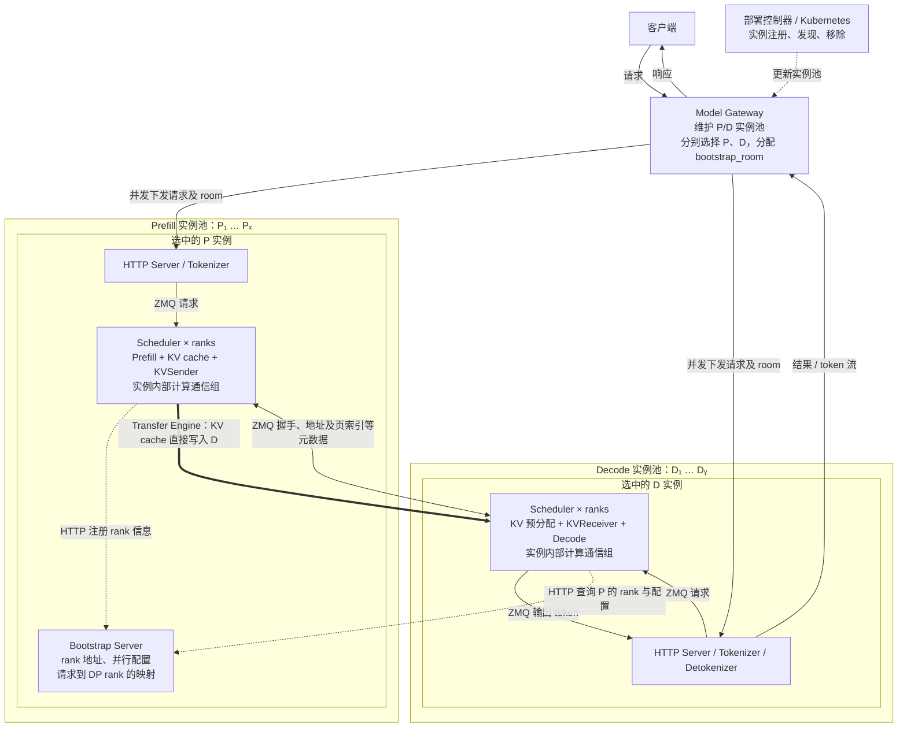
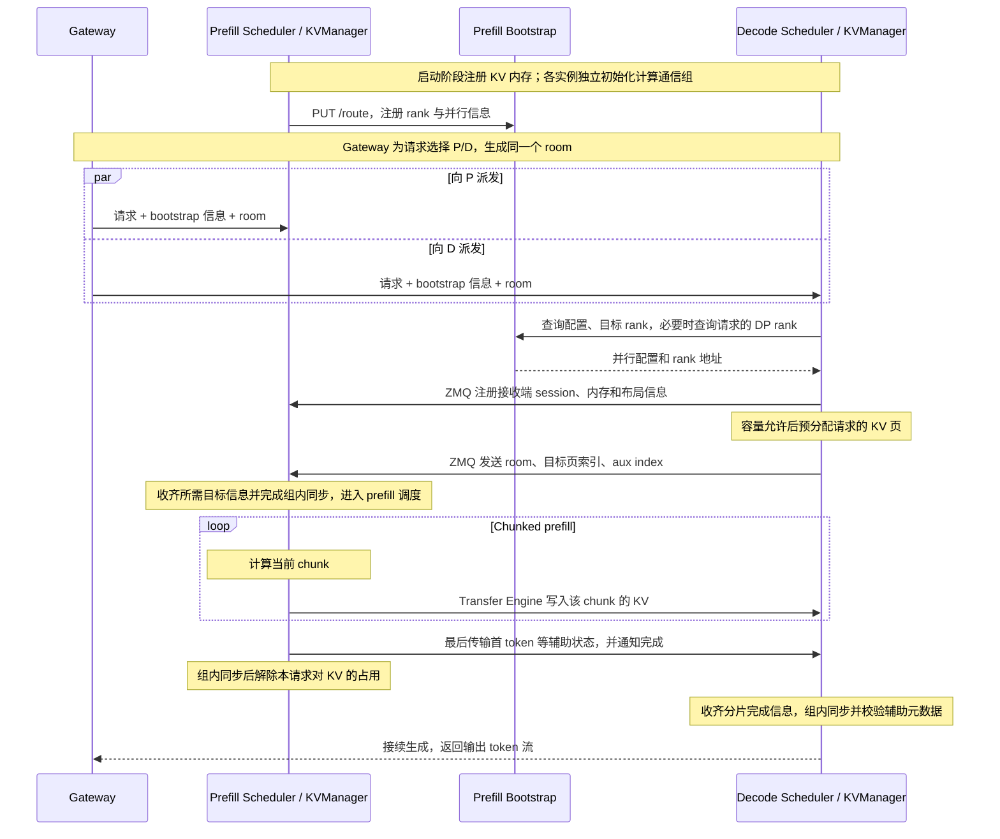

# SGLang PD 分离：通信边界、架构与弹性扩缩容

本文整理 SGLang 当前 Prefill/Decode（PD）分离的实现，重点说明请求如何路由、KV cache 如何传输、torch.distributed 的作用范围，以及在线扩缩容的边界。

- 整理日期：2026-09-05。
- 源码基准：`82c8bf8197f0474205ebf082d56480dbcb579e95`，提交日期为 2026-09-01。
- 分析范围：当前检出的 SGLang runtime 与 `sgl-model-gateway`；主要请求流程以 HTTP 接入和默认 Mooncake 后端为例。
- 验证方式：源码和仓库文档静态核对，未执行 GPU/NPU 多机部署、故障注入或扩缩容实验。

本文中的“实例”指一个独立部署、维护自身模型并行拓扑的 P 或 D 服务单元，可以跨多台机器。`xP yD` 中的 `x`、`y` 是实例数量，不是 GPU 数量，也不是 `--dp-size`。

## 1. 当前结论与通信分类

SGLang 已经实现了独立于计算通信组的 P→D KV cache 传输层，默认使用 Mooncake Transfer Engine。P、D 各自维护实例内部的计算通信组，跨实例的 KV 传输通过会话、内存注册和目标页信息建立联系。

因此，早期“PD 分离需要引入第三类通信”的判断已经体现在当前实现中。不过，通信职责和底层库并不是一一对应的：PD 握手仍使用 HTTP/ZMQ，传输状态仍会在实例内部使用 Gloo 同步。

| 通信职责 | 通信双方 | 当前实现 | 主要内容 |
| --- | --- | --- | --- |
| 请求处理与进程间消息 | Tokenizer、Scheduler、Detokenizer | 主要是 ZMQ | 请求、输出 token、控制消息 |
| 实例内部并行计算与协调 | TP、PP、DP attention、EP 等 rank | torch.distributed 通信组及 NCCL/HCCL、PyNccl、专用 MoE 后端等 | 张量集合通信、流水线数据、专家分发和组内协调 |
| PD 控制信息 | P/D 的 Bootstrap、KVManager | HTTP、ZMQ，以及后端通知机制 | 地址发现、并行配置、内存描述、页索引和完成状态 |
| PD 数据传输 | P 的 KV 内存到 D 的 KV 内存 | Mooncake、NIXL、Ascend、MoRI 等 Transfer Engine | KV cache、辅助状态 |

这里的“通信域”是职责层面的分类。严格意义上的 ProcessGroup 是其中一种组织方式，不能将 ZMQ socket、Transfer Engine session 和 torch.distributed group 视为同一种对象。

另外，不能把当前所有并行计算数据传输都等同于直接调用 `torch.distributed` API。例如，仓库存在直接调用 NCCL 的 [PyNcclCommunicator](../../python/sglang/srt/distributed/device_communicators/pynccl.py)，MoE 也有 [DeepEP、Mooncake、NIXL 等 dispatcher](../../python/sglang/srt/layers/moe/token_dispatcher/__init__.py)。

## 2. 整体架构

下面以 HTTP 接入展示一对被 Gateway 选中的 P/D 实例。每个 Scheduler 节点代表该实例中的多个 rank，省略了各进程的展开细节。Gateway 也支持 gRPC PD 路由；该路径的 tokenizer 等组件位置与 HTTP 路径不同，不能直接套用图中的所有前端进程布局。



### 2.1 Gateway 管理实例池

Gateway 从注册表中分别获得 prefill workers 和 decode workers，分别应用路由策略。当前配置可以分别指定 `--prefill-policy` 和 `--decode-policy`。

选好 P/D 后，HTTP PD 路由器为请求补充 `bootstrap_host`、`bootstrap_port`、`bootstrap_room`，再向两端并发发送请求。KV cache 直接在 P/D 之间传输，Gateway 负责请求与响应，并按需要处理 prefill 返回的 logprob 等信息。

源码：[pd_router.rs](../../sgl-model-gateway/src/routers/http/pd_router.rs)，重点查看请求字段注入、`execute_dual_dispatch_internal()` 和 P/D worker 选择逻辑。

### 2.2 Bootstrap Server 服务于 P 实例

P 侧启动 Bootstrap Server，P 的各个相关 rank 注册自己的 IP、ZMQ 端口和并行配置。D 根据请求中的 bootstrap 地址查询这些信息，再确定应该联系哪些 P rank。

| HTTP 接口 | 用途 |
| --- | --- |
| `PUT /route` | P rank 注册地址、并行配置、page size、KV dtype 等 |
| `GET /route` | 查询实例配置，或查询指定 DP/CP/TP/PP rank 的地址 |
| `POST /register_dp_rank` | 注册某个请求实际落到的 prefill DP rank |
| `POST /query_dp_ranks` | D 批量查询请求到 prefill DP rank 的映射 |
| `GET /health` | Bootstrap HTTP 服务存活检查 |

`/health` 在当前实现中直接返回 `200 OK`；完整 rank 注册情况另有 `_is_ready()` 判断。因此，仅探测该接口成功，不足以证明所有 GPU rank 已完成初始化或传输链路可用。

Bootstrap 元数据属于实例和请求的寻址机制。多个 P/D 实例不需要因此加入一个共同的 torch.distributed world。多机 P 实例会用自己的 `dist_init_addr` 主机地址定位 Bootstrap，但两类初始化服务的职责仍然不同。

源码：[disagg_service.py](../../python/sglang/srt/managers/disagg_service.py)、[common/conn.py](../../python/sglang/srt/disaggregation/common/conn.py) 中的 `CommonKVBootstrapServer`、`register_to_bootstrap()`。

### 2.3 会话信息与请求信息分开管理

| 标识或元数据 | 作用范围 | 作用 |
| --- | --- | --- |
| `bootstrap_host:bootstrap_port` | P 实例 | 找到该实例的 Bootstrap 服务 |
| `bootstrap_room` | 一次请求 | 对齐 P/D 两端的请求、KV 传输和辅助状态 |
| Transfer Engine session / agent | 传输端点 | 标识实际读写的远端引擎 |
| 已注册 KV pool 的基地址和布局 | 端点连接 | 描述可用于传输的内存，供多个请求复用 |
| KV page indices、aux index | 一次请求 | 指定本次请求的 KV 页和辅助数据槽位 |

以 Mooncake 为例，D 首次连接 P 的相关 rank 时，通过 ZMQ 注册自身的 session、KV pool 基地址及布局等信息；每个请求再发送自己的目标页索引。连接信息会缓存，不需要为每个 token 重新完成整套注册。

## 3. 一次请求如何执行

### 3.1 请求时序

下面省略缓存命中、超时、PP 协调和部分辅助状态，只展示默认 Mooncake 路径的主要依赖。最后一个 chunk 的 KV 与辅助状态由发送流程共同处理，不要求额外暴露一个独立 API。



P 的 `PrefillBootstrapQueue` 会等待 D 提供所需的目的端信息，然后将请求交给 prefill 调度。D 侧的 KV 预分配需要通过容量检查，因此 D 内存压力可能使请求停留在预分配/握手阶段，而不只是表现为后续 decode 变慢。

### 3.2 核心执行伪代码

```python
# 示意流程，非可直接执行的 SGLang API。
# P、D 是分别选择的实例；room 标识这一次 PD 请求。
P, D = gateway.select_prefill_and_decode(request)
room = new_room_id()
gateway.dispatch_concurrently(P, D, request, room, P.bootstrap_address)

# D 获取 P 的配置，并根据双方并行拓扑选择目标 rank。
peers = D.lookup_prefill_ranks(P.bootstrap_address, room)

# D 在容量允许时分配目标 KV 页，并告知 P 写入位置。
dst_pages = D.allocate_kv_pages(request)
D.receiver.announce_destination(peers, room, dst_pages)

# P 等待目的端信息；各 chunk 计算完成后提交相应 KV 传输。
P.wait_for_destination_and_local_rank_consensus(room)
for chunk in P.prefill(request):
    P.sender.transfer_kv(chunk, room)

# 最后一块还涉及首个输出 token、logprob 或模型所需辅助状态。
P.sender.complete_final_chunk_and_metadata(room)

# 两端分别轮询传输完成情况，并与本实例的相关 rank 同步。
P.wait_for_transfer_and_local_rank_consensus(room)
D.wait_for_transfer_and_local_rank_consensus(room)

# D 校验 room 并接续生成；P 解除请求的 KV 占用。
# P 的前缀缓存是否保留，由缓存管理策略决定。
D.commit_received_metadata_and_decode(room)
P.release_request_kv_reference(room)
```

### 3.3 Scheduler 中的队列

| 所在端 | 队列或入口 | 主要职责 |
| --- | --- | --- |
| P | `PrefillBootstrapQueue` | 等待目的端准备好，初始化发送方请求信息 |
| P | `send_kv_chunk()` | 将已计算的 token 区间映射为 KV 页，并提交发送 |
| P | `disagg_prefill_inflight_queue` | 跟踪已计算但传输尚未结束的请求，完成后释放请求占用 |
| D | `DecodePreallocQueue` | 解析 P 信息、检查容量、分配目标 KV 页和元数据槽位 |
| D | `DecodeTransferQueue` | 等待传输，校验并提交首 token 等元数据 |
| D | `get_new_prebuilt_batch()` | 将已接收 prefill 结果的请求接入后续生成流程 |

`send_kv_chunk()` 会将非最终 chunk 的发送边界按完整 page 对齐，尚未填满的尾页延迟到后续发送。这样，chunk 计算和 KV 传输可以形成流水；实际重叠程度受调度模式、传输后端和硬件影响。

Mooncake 的底层批量写接口虽然是同步接口，上层会通过传输队列、后台工作线程和线程池执行，Scheduler 通过轮询推进状态。不能仅凭底层函数名中的 `sync` 判断整个推理调度是串行阻塞的。

源码：[prefill.py](../../python/sglang/srt/disaggregation/prefill.py)、[decode.py](../../python/sglang/srt/disaggregation/decode.py)、[mooncake/conn.py](../../python/sglang/srt/disaggregation/mooncake/conn.py)。

### 3.4 传输内容不止 KV cache

P 完成 prefill 后会产生首个输出 token。D 接收后将其写入请求状态，再继续后续生成。

辅助信息还包括 cached token 计数、按需使用的 logprob、推测解码需要的 top-k/hidden state 等；混合模型还可能传输 Mamba、SWA 等额外状态。具体内容取决于模型和配置。

`MetadataBuffers` 中还保存 `bootstrap_room`。D 在提交元数据时检查实际 room 是否与请求一致；元数据尚未就绪时继续等待，检测到不匹配时中止请求，避免将其他请求的状态提交到当前上下文。

源码：[utils.py](../../python/sglang/srt/disaggregation/utils.py) 中的 `MetadataBuffers`、[decode.py](../../python/sglang/srt/disaggregation/decode.py) 中的 `_commit_transfer_to_req()`。

## 4. 传输状态与 Gloo 的边界

公共接口定义了以下 `KVPoll` 值：

| 状态 | 值 | 含义 |
| --- | --- | --- |
| `Failed` | 0 | 请求传输失败 |
| `Bootstrapping` | 1 | 仍在准备握手或目标信息 |
| `WaitingForInput` | 2 | 等待下一阶段的数据或传输完成，具体语义取决于发送端/接收端 |
| `Transferring` | 3 | 传输进行中，是否显式进入该状态取决于后端 |
| `Success` | 4 | 本端判定传输成功 |

这些值不是所有后端必须逐一经历的严格状态链。例如，Mooncake 的请求状态可以在 `WaitingForInput` 期间覆盖计算、传输和等待完成通知，随后直接进入 `Success`。

一个请求的 KV 通常分布在多个 rank 上。某个 rank 的传输成功，不代表整个请求已具备进入下一阶段的条件，所以需要实例内部的状态共识。

```python
# 每个元素对应一个待检查请求在本 rank 上的传输状态。
# shape: [请求数]；dtype: torch.uint8；device: CPU。
states = torch.tensor(
    [int(poller.poll()) for poller in pollers],
    dtype=torch.uint8,
    device="cpu",
)

# group 属于当前 P 或 D 实例的 attention TP ranks。
# MIN 会传播失败状态，并使所有 rank 等待尚未完成的分片。
dist.all_reduce(states, op=dist.ReduceOp.MIN, group=attn_tp_cpu_group)

# P 侧还会跨该 DP 分片内的 attention CP ranks 同步。
dist.all_reduce(states, op=dist.ReduceOp.MIN, group=attn_cp_cpu_group)
```

上面最后一步描述 P 侧路径。D 的相关队列使用自身的 `attn_tp_cpu_group`；PP 模式还存在对应的请求推进协调。各端的这些同步都没有将整个 P/D 实例池合并为一个计算通信组。

Mooncake 的 D rank 还会先根据拓扑映射统计自己需要收到多少个 P rank 的完成通知。只有收齐这些通知，该 D rank 才标记请求成功，之后再参与 D 实例内的组同步。

源码：[base/conn.py](../../python/sglang/srt/disaggregation/base/conn.py)、[utils.py](../../python/sglang/srt/disaggregation/utils.py) 的 `poll_and_all_reduce*()`、[scheduler.py](../../python/sglang/srt/managers/scheduler.py) 的 PD 队列初始化。

## 5. Transfer Engine 后端

后端通过 `KVArgs / KVManager / KVSender / KVReceiver / KVBootstrapServer` 接口接入，选择入口是 [utils.py](../../python/sglang/srt/disaggregation/utils.py) 的 `TransferBackend` 和 `get_kv_class()`。

| `--disaggregation-transfer-backend` | 当前实现 | 关键特征 |
| --- | --- | --- |
| `mooncake` | Mooncake Transfer Engine | 默认后端，内存注册、session、批量远端写；常规路径使用 RDMA |
| `nixl` | NIXL agent | 创建传输描述符并发起 `WRITE`；默认选择 UCX 插件 |
| `ascend` | `memfabric_hybrid.TransferEngine` | 支持 SDMA / Device RDMA，使用配置存储服务 |
| `mori` | MoRI `IOEngine` | 内存与引擎描述符，包含 RDMA 后端实现 |
| `fake` | 模拟发送和接收 | 用于测试、模拟，不承担真实 KV 数据传输 |

### 5.1 Mooncake 与 NIXL 的数据方向

当前这两条 SGLang 集成路径都是由 P 发起写入 D 的操作。不要仅根据某个后端库支持 READ，就推断当前 SGLang 的集成采用 D 主动拉取 KV。

```python
# 示意底层调用：每个地址列表长度均为本批次内存块数量 N。
# src_addrs/dst_addrs 是地址整数列表，lengths 是各块字节数。
mooncake_engine.batch_transfer_sync_write(
    session_id, src_addrs, dst_addrs, lengths
)

# NIXL 以源/目标描述符和远端 agent 标识创建 WRITE 操作。
handle = nixl_agent.initialize_xfer(
    "WRITE", src_descs, dst_descs, peer_name, notification
)
nixl_agent.transfer(handle)
```

Mooncake 的常规引擎初始化使用 `P2PHANDSHAKE` 与 `rdma`，也有 NVLink 相关内存池/传输配置。辅助数据的路径需单独看：当前某些 NVLink 配置或显式开启 `SGLANG_MOONCAKE_SEND_AUX_TCP` 时，辅助数据通过 ZMQ/TCP 发送。因此，“KV 主体通过 RDMA/NVLink”不意味着所有 PD 消息都采用同一传输方式。

源码：[mooncake_transfer_engine.py](../../python/sglang/srt/distributed/device_communicators/mooncake_transfer_engine.py)、[mooncake/conn.py](../../python/sglang/srt/disaggregation/mooncake/conn.py)、[nixl/conn.py](../../python/sglang/srt/disaggregation/nixl/conn.py)。

### 5.2 Ascend 的上层复用与底层替换

`AscendKVManager` 继承 Mooncake 的上层传输管理流程，但 `init_engine()` 创建的是 `AscendTransferEngine`，其底层为 `memfabric_hybrid.TransferEngine`。

- `ASCEND_MF_STORE_URL` 指定引擎配置存储地址，P 的相应启动路径会创建配置存储服务。
- `ASCEND_MF_TRANSFER_PROTOCOL=sdma` 或 `device_rdma` 选择传输方式；当前缺省采用 SDMA。
- Device RDMA 初始化前，代码会在当前实例的 world group 上执行一次 HCCL `all_gather`，预先完成 HCCL 初始化以避免冲突。

这个初始化中的 `all_gather` 属于实例内部，不能据此认定 P/D 之间的 KV 由 HCCL collective 传输。专用 Transfer Engine 也可以有自己的配置存储和握手机制；独立于 torch 计算通信组不意味着完全没有控制服务。

源码：[ascend/conn.py](../../python/sglang/srt/disaggregation/ascend/conn.py)、[ascend/transfer_engine.py](../../python/sglang/srt/disaggregation/ascend/transfer_engine.py)、[disagg_service.py](../../python/sglang/srt/managers/disagg_service.py)。

MoRI 的实现入口为 [mori/conn.py](../../python/sglang/srt/disaggregation/mori/conn.py)。各后端及版本的能力不能自动相互推广。

## 6. P/D 并行拓扑可以不同，但有约束

`CommonKVManager._resolve_rank_mapping()` 会根据两端的 attention TP、CP、PP 配置计算目标 rank 和预期响应数量。

| 情况 | 当前公共映射逻辑 |
| --- | --- |
| P/D attention TP 相同 | 对应 rank 之间建立 KV 传输关系 |
| D 的 attention TP 更大 | 多个 D rank 对应较少的 P rank，结合布局进行分片传输 |
| P 的 attention TP 更大 | 非 MLA 模型的一个 D rank 可能需要接收多个 P rank 的 KV 分片 |
| MLA | 某些不同 TP 场景只需选择一个 P rank 提供 KV，其余连接仍可能通过 dummy 请求参与协议 |
| CP | 当前公共映射要求 D 的 attention CP size 为 1；P 可按配置由 CP rank 0 或所有 CP ranks 参与传输 |
| PP | 当前公共映射要求 D 的 PP size 等于 P 的 PP size，或 D 的 PP size 为 1 |

不同 TP 的映射使用整数倍分组逻辑，不应将其理解为任意两种 TP 配置均可无条件互通。非 MLA 模型使用不同 TP 时，当前代码还会提示不保证性能。

握手阶段会检查双方发布的 `page_size` 和 `kv_cache_dtype` 是否一致。但这两个检查不能替代完整兼容性判断：部署还需要匹配模型权重、KV 布局、后端能力及相关配置。表中的映射能力也不代表支持运行中原地修改一个实例的 TP/PP 拓扑。

DP 要再分两层看：Gateway 选择的是 P/D 实例；请求进入一个带 DP 的实例后，还需要确定实际执行的 DP rank。D 会使用显式指定的 rank、`follow_bootstrap_room` 的 room 取模映射，或向 P Bootstrap 查询实际分配结果。

源码：[common/conn.py](../../python/sglang/srt/disaggregation/common/conn.py) 的 `try_ensure_parallel_info()`、`_resolve_rank_mapping()`，以及 [decode.py](../../python/sglang/srt/disaggregation/decode.py) 的 `_resolve_prefill_dp_rank()`。

## 7. 在线扩缩容支持到哪一层

### 7.1 已有的实例池能力

Gateway 已有动态 worker 注册、更新、移除接口，也支持 Kubernetes 服务发现。PD 模式可用不同的 `--prefill-selector`、`--decode-selector` 发现两类实例。

| 接口 | 用途 |
| --- | --- |
| `POST /workers` | 将 worker 注册操作加入处理队列 |
| `GET /workers` | 查询当前 worker 列表 |
| `PUT /workers/{worker_id}` | 将 worker 更新操作加入处理队列 |
| `DELETE /workers/{worker_id}` | 将 worker 移除操作加入处理队列 |

实例扩容的流程可以概括为：

```python
# 部署控制器创建新实例，加载模型并初始化其内部计算通信组。
new_instance = controller.start_prefill_or_decode_instance()
controller.wait_until_instance_ready(new_instance)

# 通过 API 或 Kubernetes 服务发现进入 Gateway 的实例注册表。
gateway.register(new_instance)

# 后续请求可以选择新实例；原有实例保持自己的并行拓扑。
P, D = gateway.select_prefill_and_decode(next_request)
```

这为 `xP yD → (x+1)P yD` 或 `xP yD → xP (y+1)D` 提供了通信与路由基础。P/D 之间按需建立连接，而不是让整个池共用一个需要随副本数变化的 collective world。

源码与配置：[Gateway 文档](sgl_model_gateway.md)、[service_discovery.rs](../../sgl-model-gateway/src/service_discovery.rs)、[worker_registry.rs](../../sgl-model-gateway/src/core/worker_registry.rs)。

### 7.2 需要与自动伸缩控制器、请求迁移区分

| 能力 | 本文对当前代码的结论 |
| --- | --- |
| 动态增加/移除 P、D 路由端点 | Gateway 有对应接口和服务发现机制 |
| 按负载自动决定 P/D 副本数，并创建资源 | 需要部署控制器或其他自动伸缩系统配合；worker 发现本身不完成这些决策 |
| 一个正在运行的 TP=8 实例原地变为 TP=16 | 本文分析的 PD 机制不提供此保证 |
| 移除 D 后自动迁移所有在途 decode 请求 | 不能从当前 PD 传输和 worker 移除机制得出这一保证 |
| 任意后端、任意拓扑下都实现无损弹性 | 未通过本文的静态分析或运行实验验证 |

缩容时，停止新请求路由、等待该实例的在途计算和传输结束、再终止进程，是部署层需要协调的流程。单独调用 worker 移除接口不能等同于已经完成请求排空或 KV 迁移。

因此，对早期判断更准确的表述是：固定成员的计算通信组不适合直接承担整个弹性 P/D 实例池的成员管理；SGLang 将跨实例 KV 传输独立出来，同时保留实例内部的 torch/Gloo/NCCL/HCCL 等机制。不能仅凭代码中出现这些库，就判定 PD 不支持实例池扩缩容。

## 8. 故障处理、配置与排查入口

### 8.1 常用配置

以下默认值以本次检出的 [server_args.py](../../python/sglang/srt/server_args.py) 和 [environ.py](../../python/sglang/srt/environ.py) 为准。

| 配置 | 默认值 | 作用 |
| --- | --- | --- |
| `--disaggregation-mode` | `null` | 选择 `prefill` 或 `decode` 角色 |
| `--disaggregation-transfer-backend` | `mooncake` | 选择 KV 传输后端 |
| `--disaggregation-bootstrap-port` | `8998` | P 侧 Bootstrap HTTP 端口 |
| `--disaggregation-ib-device` | `None` | 指定传输使用的 IB/RoCE 设备，具体解析依后端而定 |
| `SGLANG_DISAGGREGATION_BOOTSTRAP_TIMEOUT` | 300 秒 | P 等待目的端信息的超时配置 |
| `SGLANG_DISAGGREGATION_WAITING_TIMEOUT` | 300 秒 | D 等待 KV 传输完成的超时配置 |
| `SGLANG_DISAGGREGATION_HEARTBEAT_INTERVAL` | 5 秒 | D 检查 P Bootstrap 的间隔 |
| `SGLANG_DISAGGREGATION_HEARTBEAT_MAX_FAILURE` | 2 | 达到连续失败次数后触发故障处理 |
| `SGLANG_DISAGGREGATION_QUEUE_SIZE` | 4 | Mooncake P 侧传输队列数量 |
| `SGLANG_DISAGGREGATION_NIXL_BACKEND` | `UCX` | NIXL 传输插件 |

这些配置在不同后端的实现细节上可能有差异。心跳参数也不能机械地换算成严格的故障发现时延，因为 HTTP 超时、线程调度和其他检查都会产生影响。

### 8.2 故障会怎样推进

默认 Mooncake 路径中，D 会对已联系的 P Bootstrap 做心跳检查。连续失败后会清理相应连接/配置缓存，并将受影响、尚未完成的请求标记失败。P/D 还分别处理目的端信息等待超时和 KV 完成等待超时。

失败状态通过实例内部的状态同步传播，Scheduler 随后中止请求并清理相应资源。Gateway 层有自己的健康检查和重试机制，但这不能等同于底层自动恢复一个已经生成部分输出的请求上下文。

网络连通性也需要按层检查：worker HTTP 端口、P Bootstrap 端口、各 rank 的 ZMQ 端口，以及 Transfer Engine 自身的端点/数据通路承担不同职责。只保证 Gateway 能访问 worker HTTP 服务，不足以保证 P/D KV 传输可用。

| 现象 | 优先检查 |
| --- | --- |
| 请求一直停在 P 的 bootstrap 队列 | D 是否已接到请求、是否有 KV 容量、是否成功发送目标页信息、room/DP rank 是否对应 |
| D 一直等待传输 | P 是否完成计算、数据通路是否通、所需 P rank 是否都完成、辅助状态是否已到达 |
| 一个 rank 成功但请求不推进 | 同组其他 rank 的状态，以及 TP/CP/PP 的预期分片/通知数量 |
| room 校验失败 | 请求与辅助元数据槽位的对应关系、是否存在上下文错配 |
| 新实例注册后不能承接请求 | worker readiness、路由注册结果、模型/并行配置兼容性、跨实例寻址与传输链路 |

## 9. 进一步阅读与验证范围

仓库文档：[PD Disaggregation](pd_disaggregation.md)、[SGLang Model Gateway](sgl_model_gateway.md)。本文对应的源码快照可在 [GitHub 固定提交](https://github.com/sgl-project/sglang/tree/82c8bf8197f0474205ebf082d56480dbcb579e95) 中查阅。

已有测试入口包括：

- [基础 PD 测试](../../test/registered/disaggregation/test_disaggregation_basic.py)。
- [不同 TP 配置测试](../../test/registered/distributed/test_disaggregation_different_tp.py)。
- [DP attention 测试](../../test/registered/distributed/test_disaggregation_dp_attention.py)。
- [PP 测试](../../test/registered/distributed/test_disaggregation_pp.py)。
- [混合 attention 测试](../../test/registered/distributed/test_disaggregation_hybrid_attention.py)。

这些文件用于继续定位验证场景；本文没有执行它们，也不将测试文件的存在视为所有后端、硬件和拓扑组合均已通过验证。实际部署应针对选定后端检查启动、KV 内容正确性、在途故障处理及实例增删行为。
